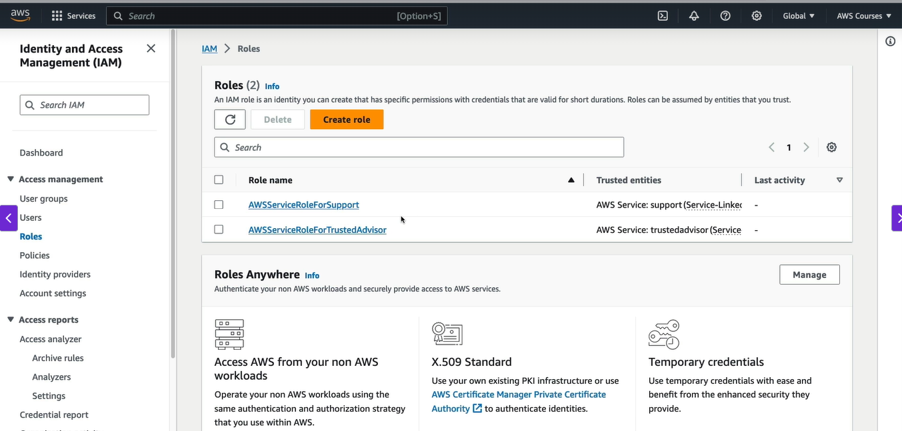
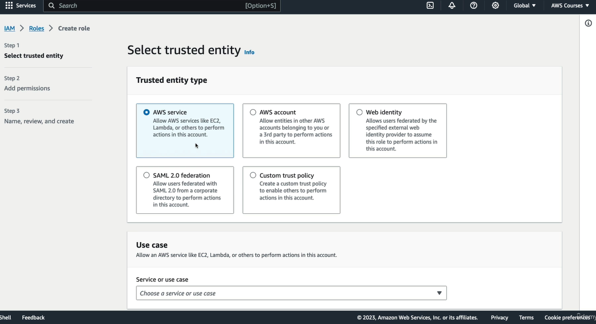
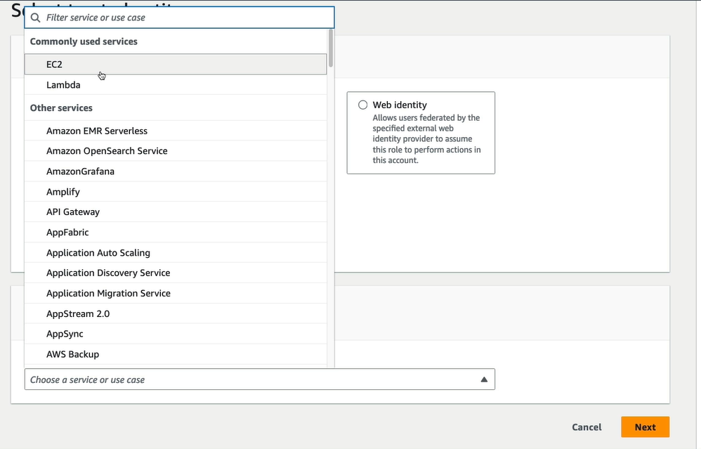
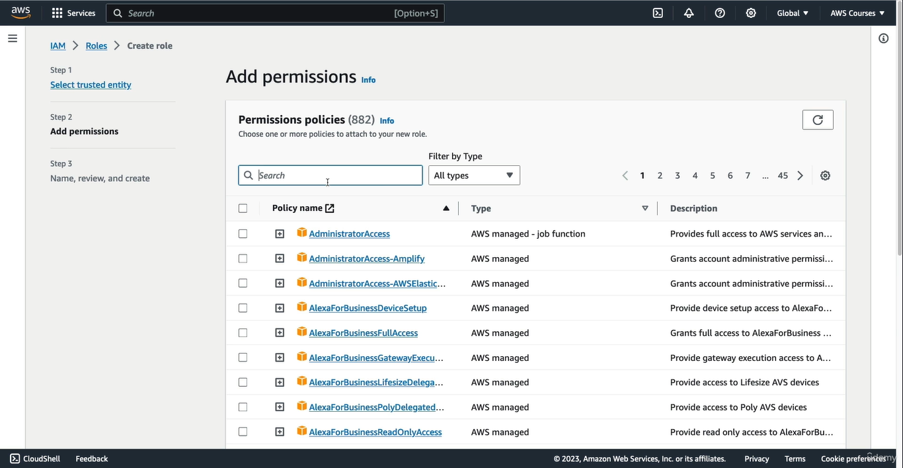
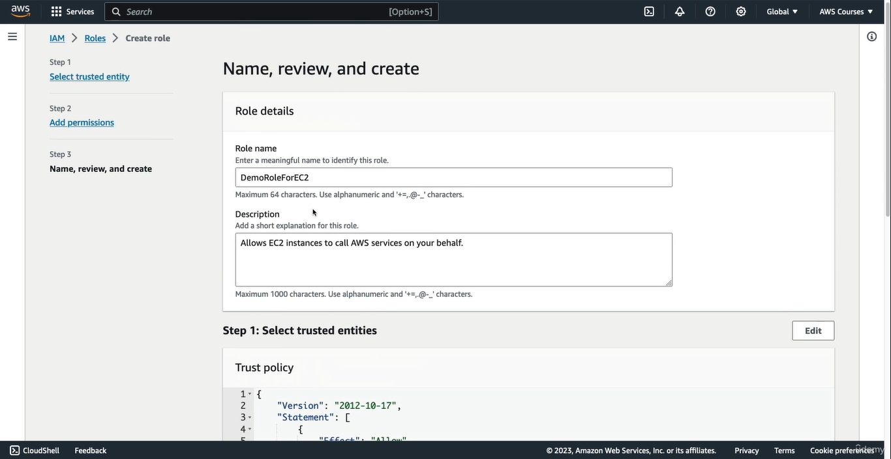

## EC2
Elastic compute cloud ,it is a infrastructure as a service.it is on-demand virtual machine.

### what can we chose while creating EC2
* we can chose operating system.
* How much computer power & core (CPU) 
* chose How much RAM
* chose storage space
    ```
    chose any one:
    - do you want storage that is going to be attached through the network(EBS & EFS)
    - Hardware 
    ```
* Network Card
* Firewall rulse: Security group
* Bootstrap script
    ```
    Well, bootstrapping means launching commands when the machine starts.So, that script is only run once and when it first starts,and then will never be run again.

    -what can you do with ec2 bootstrap:
    When an EC2 instance launches, you can run custom shell commands or scripts automatically. These might include
    1. Installing software (e.g., Apache, Python, Node.js)2. Downloading and configuring code
    3. Starting services (e.g., a web server or database)4. Setting environment variables or configuration files

    You define your bootstrap instructions in the "User Data" field when launching an EC2 instance. This field can contain:
    1. Shell script (for Linux)
    2. PowerShell (for Windows)

    when EC2 instance starts the EC2 service detects the user data script.The operating system runs the script once at boot time.
    ```


### Create role for EC2
* Got IAM -> Rol ->Create role
    
* select aws service : becuase we are creating role for serevice.
    
* in above image from in service and user dropdown select serivice for which role you are going to create.in ower case select EC2
    
* chose use case EC2 on same above page 
* click on next

* attache policies with role.
    
* Give role name
    