## EC2
Elastic compute cloud ,it is a infrastructure as a service.it is on-demand virtual machine.
Amazon Elastic Compute Cloud (Amazon EC2) provides on-demand, scalable computing capacity in the Amazon Web Services (AWS) Cloud. Using Amazon EC2 reduces hardware costs so you can develop and deploy applications faster. You can use Amazon EC2 to launch as many or as few virtual servers as you need, configure security and networking, and manage storage. You can add capacity (scale up) to handle compute-heavy tasks, such as monthly or yearly processes, or spikes in website traffic. When usage decreases, you can reduce capacity (scale down) again.

An EC2 instance is a virtual server in the AWS Cloud. When you launch an EC2 instance, the instance type that you specify determines the hardware available to your instance. Each instance type offers a different balance of compute, memory, network, and storage resources.

## AMI(Amazone Machine Image)
An AMI (Amazon Machine Image) is like a template or snapshot of an EC2 instance.AMI itself does not have an instance type.But when you launch an EC2 instance from an AMI, you must choose an instance type at that time
                       
An AMI is a template that contains the software configuration (operating system, application server, and applications) required to launch an EC2 instance. 

### It includes:
- A root volume for the instance (usually an OS like Linux or Windows)
- Launch permissions that control which AWS accounts can use the AMI
- Block device mapping that specifies the volumes to attach when the instance launches

### An AMI is specific to the following:

- sw11111111Region
- Operating system
- Processor architecture
- Root device type
- Virtualization type

You can launch multiple instances from a single AMI when you require multiple instances with the same configuration. You can use different AMIs to launch instances when you require instances with different configurations,

You can create an AMI from your Amazon EC2 instances and then use it to launch instances with the same configuration. You can copy an AMI to another AWS Region, and then use it to launch instances in that Region. You can also share an AMI that you created with other accounts so that they can launch instances with the same configuration.

## AMI Life cycle

1. Create AMIs

     While Amazon provides AMIs that you can use to launch your instances, you can create custom AMIs based on your needs. To create a custom AMI, launch an instance from an existing AMI, customize the instance (for example, install software and configure operating system settings), and then create an AMI from the instance. Any instance customizations are saved to the new AMI, so that instances launched from your new AMI include these customizations. 

2. Copy AMIs:

     we create an AMI and it in a specific AWS Region.Lets say we have stored it in us-east-1 region, then we can only create instance in us-east-1 region from that AMI.If you need to launch instances with the same configuration in multiple Regions, copy the AMI to the other Regions.

3. Deprecate AMIs

    A deprecation date is the date when something is officially marked as outdated or no longer recommended for use.To mark an AMI as superseded or out of date, you can set an immediate or future deprecation date.If you makes an AMI as deprecated it will not be in list of AMI it will be removed from AMI list.

4. Disable AMIs.

     To temporarily prevent an AMI from being used, you can disable it. When an AMI is disabled, it can't be used to launch new instances. However, if you re-enable the AMI, it can be used to launch instances again. Note that disabling an AMI doesn't affect existing instances that have already been launched from it.

5. Deregister (delete) AMIs.
    
     When you no longer need an AMI, you can deregister it, preventing it from being used to launch new instances. If the AMI matches a retention rule, it moves to the Recycle Bin, where it can be restored before its retention period expires, after which it is permanently deleted. If it doesn't match a retention rule, it is permanently deleted immediately. Note that deregistering an AMI does not affect existing instances that were launched from the AMI.

## Create EBS-backed AMI from an Amazon EC2 instance
- Start with an existing AMI: Find an existing AMI that is similar to the AMI that you'd like to create. This can be an AMI you have obtained from the AWS Marketplace, an AMI that you have created using VM Import/Export, or any other AMI that you can access.

- TLaunch instance from existing AMI: he way to configure an AMI is to launch an instance from the AMI on which you'd like to base your new AMI, and then customize the instance. Then, you'll create a new AMI that includes the customizations.

- Customize the instance: Connect to your instance and customize it for your needs. Your new AMI will include these customizations.
    1. Install software and applications
    2. Copy data
    3. Reduce start time by deleting temporary files and defragmenting your hard drive
    4. Attach additional EBS volumes

- Create image: When you create an AMI from a running EC2 instance,By default, Amazon EC2 will stop (reboot) the instance temporarily.This is done to make sure that no files are being written or changed while the AMI (snapshot) is being created.This helps keep the AMI in a clean and consistent state, like taking a photo of a paused system

    But If you know your system is stable (e.g., no files are being written, no app is saving data),You can choose to skip the reboot during AMI creation.This saves time and avoids downtime for your application.

    During the AMI-creation process, Amazon EC2 creates snapshots of your instance's root volume and any other EBS volumes attached to your instance.These snapshots are stored in your AWS account, and you are charged for storing them.Even if you don’t use the AMI, you’ll keep getting billed until emove it from your account and delete the snapshots manually

    If your EC2 instance has encrypted EBS volumes, those volumes are also captured in the AMI.Now, if you try to launch a new EC2 instance using this AMI, It will only work on EC2 instance types that support EBS encryption Otherwise, it will fail to launch.

    Depending on the size of the volumes, it can take several minutes for the AMI-creation process to complete (sometimes up to 24 hours). You might find it more efficient to create snapshots of your volumes before creating your AMI. This way, only small, incremental snapshots need to be created when the AMI is created, and the process completes more quickly (the total time for snapshot creation remains the same)

- New AMI: After the process completes, you have a new AMI and snapshot (snapshot #2) created from the root volume of the instance.When you create a new AMI from an EC2 instance that has A root volume And additional EBS or instance-store volumes,The new AMI remembers all that volume information using block device mapping.So when you launch a new instance using that AMI,It automatically attaches all the volumes (just like the original),With the same size, type, and device names


- Launch instance from new AMI: When you create an AMI, AWS takes a snapshot of the root volume.Later, when you launch a new EC2 instance using that AMI a new EBS volume is automatically created from that snapshot this volume becomes the new root disk of the instance.If your original EC2 instance had Extra EBS volumes Or instance store volumes the AMI remembers them using block device mapping.So, when you launch a new instance from that AMI, it automatically includes these volumes too.

Instance store volumes (temporary local storage) are not backed up in the AMI.So, when a new instance is launched new instance-store volumes are created fresh they do not contain any previous data.Instance store = temporary storage → data is not saved in the AMI.

EBS volumes keep their data and are restored from the snapshot.

### what can we chose while creating EC2
* we can chose operating system.
* How much computer power & core (CPU) 
* chose How much RAM
* chose storage space
    ```
    chose any one:
    - do you want storage that is going to be attached through the network(EBS & EFS)
    - Hardware 
    ```
* Network Card
* Firewall rulse: Security group
* Bootstrap script
    ```
    Well, bootstrapping means launching commands when the machine starts.So, that script is only run once and when it first starts,and then will never be run again.

    -what can you do with ec2 bootstrap:
    When an EC2 instance launches, you can run custom shell commands or scripts automatically. These might include
    1. Installing software (e.g., Apache, Python, Node.js)2. Downloading and configuring code
    3. Starting services (e.g., a web server or database)4. Setting environment variables or configuration files

    You define your bootstrap instructions in the "User Data" field when launching an EC2 instance. This field can contain:
    1. Shell script (for Linux)
    2. PowerShell (for Windows)

    when EC2 instance starts the EC2 service detects the user data script.The operating system runs the script once at boot time.
    ```

## create EC2
* Go to Console Home and select EC2.
    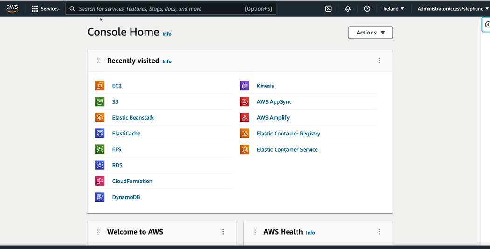

* Got instaces->instance and then click on Launch instances

    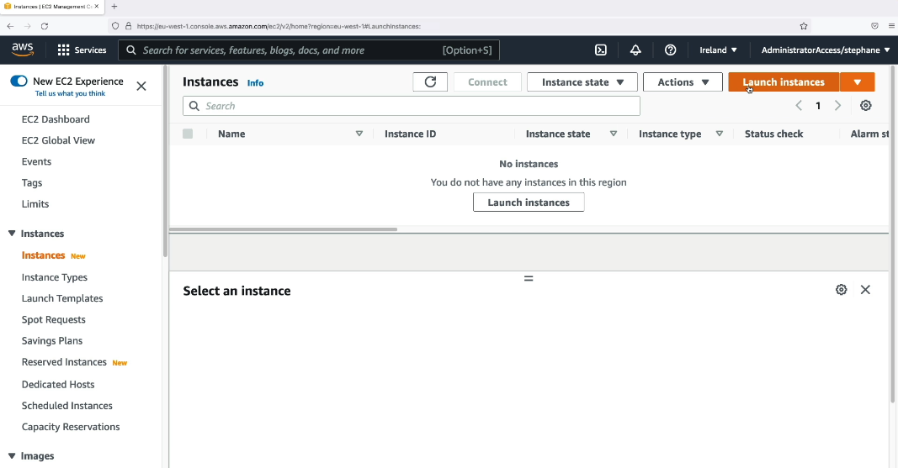

* Give name and tage to ec2

    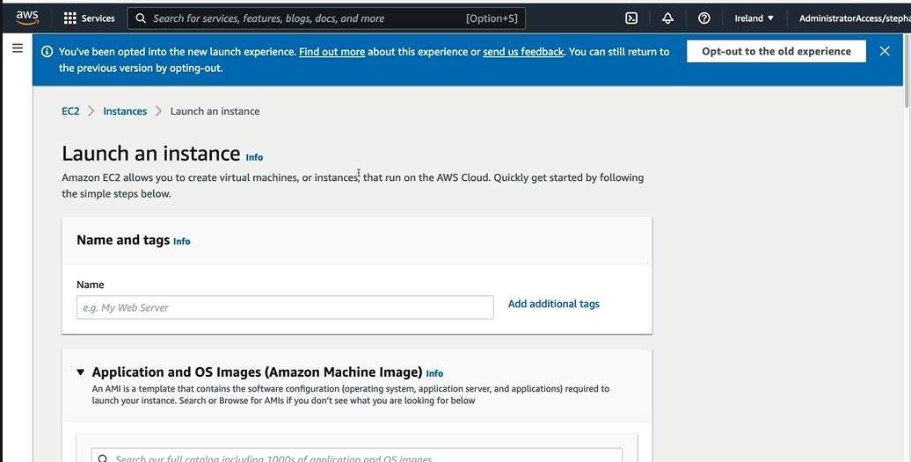

* Chose base image for your ec2 instance

    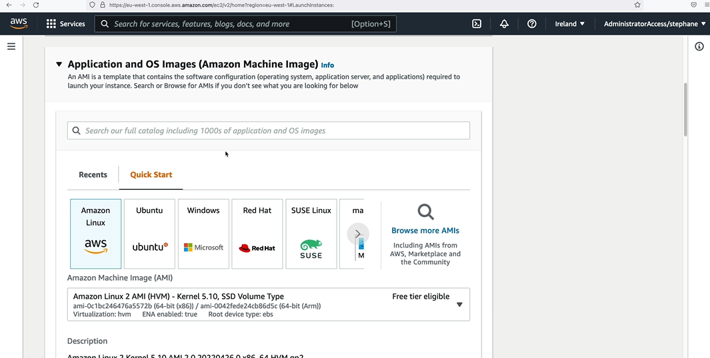

* Chose Instance type. Instance type is differ based on CPU, Memory and Cost    

 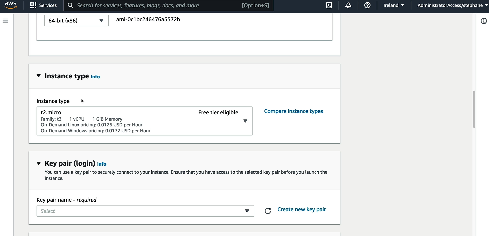

* Next is key pair to login to your instance. It is necessory if you use SSH utility to access your instance . Click on "Create New Key Pair"    

 

 * Then enter detials of key pairs. On click Create key pair after filling below details you will get a file with pirvate key.
    
     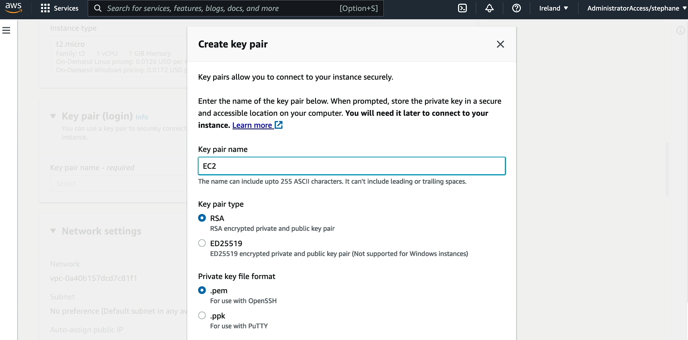

* Then configure network 

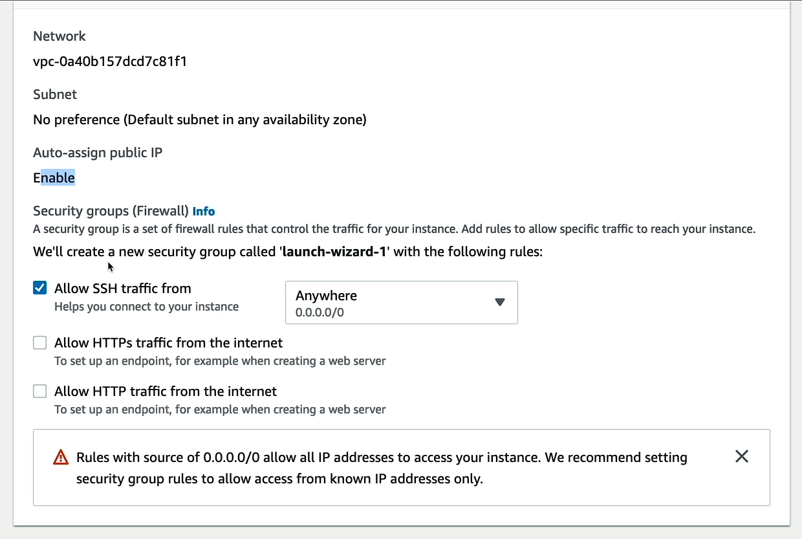

* Then configure Storage details 

    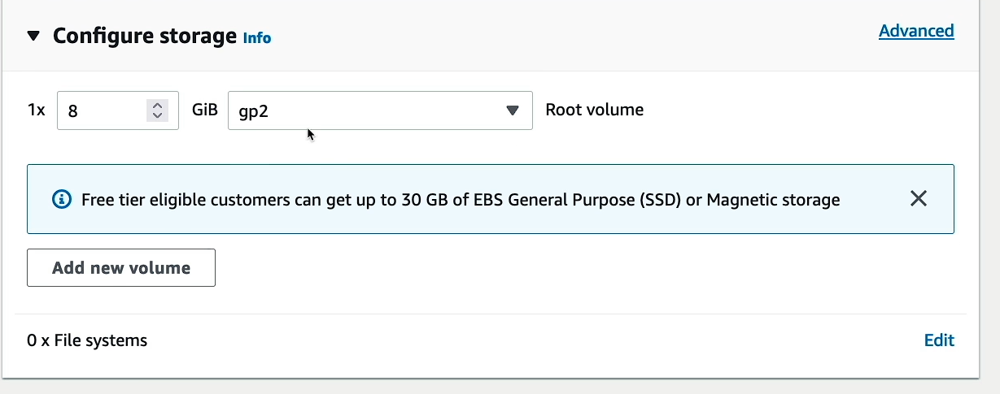

    * In above image you can click on Advance and you will get below window to configure advance storage

    * Delete on Termination oprtion is "Yes". The "Delete on Termination" option in the storage configuration of an EC2 instance refers to whether an attached EBS volume (Elastic Block Store) should be automatically deleted when the EC2 instance is terminated.

    * EBS volumes are persistent storage devices that are attached to EC2 instances.You can attach one or more EBS volumes to an EC2 instance, and they retain their data even after the instance is stopped or terminated (unless you specifically delete them).

        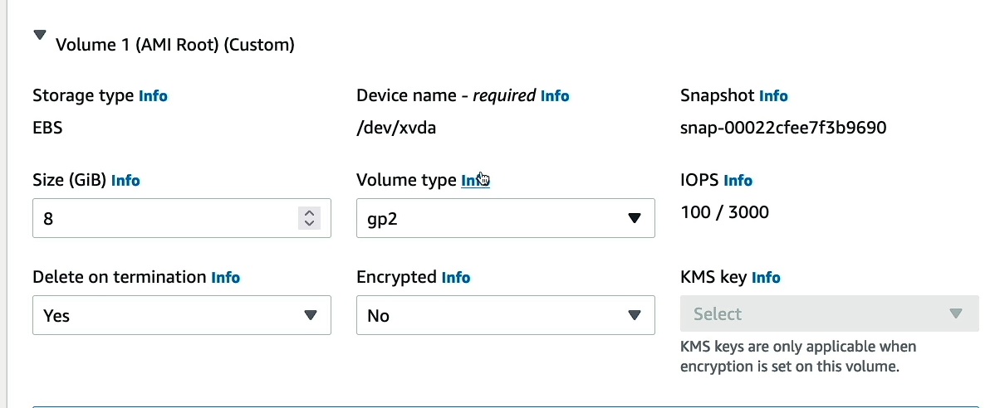

* Go to "Advance Details" skip all the drop down and there you can find "User Data" Area box where you can put some commands that will excute one time before start ec2.

 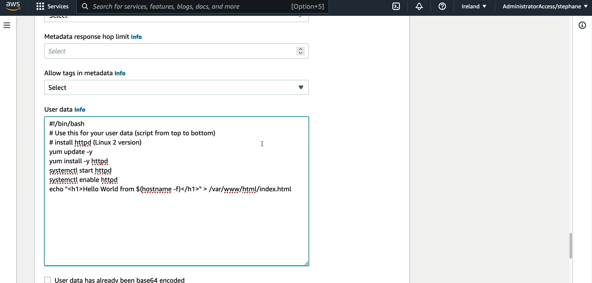

* The you can see summary of ec2. In below image we are going to create only one instance . But you can create more then one instance by incresing "Number of instance"

 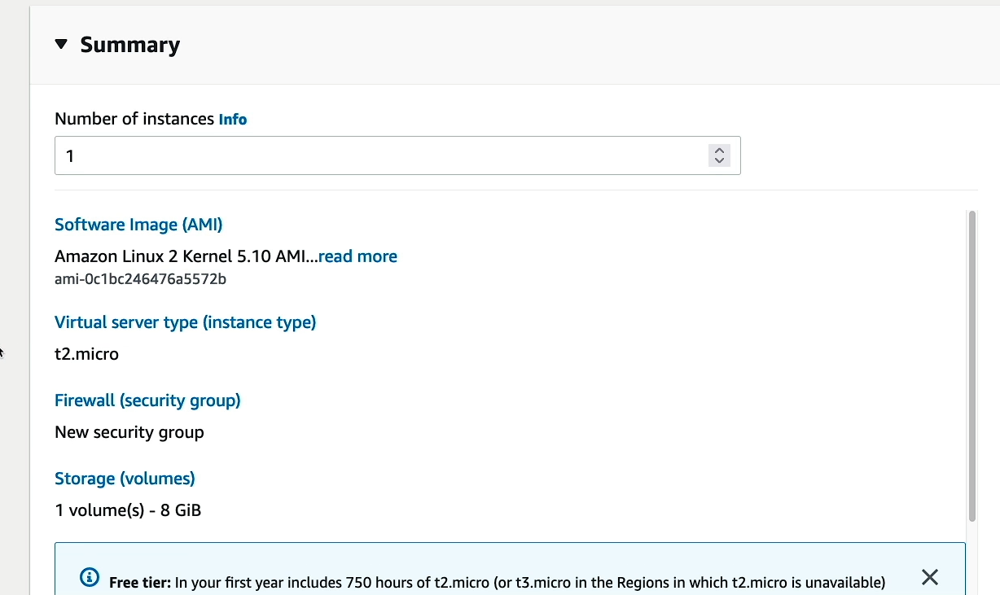

* Then click on "Launch Instance"

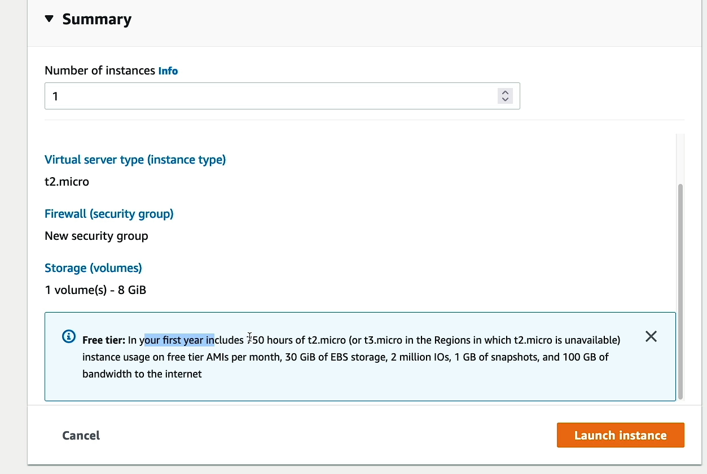


* When you create an EC2 instance in AWS, it gets assigned two types of IP addresses: a Public IP address and a Private IP address. These two IP addresses serve different purposes and have different scopes. The private IP address is used for communication within the VPC and cannot be accessed directly from the internet. The private IP address remains fixed as long as the instance exists in the VPC, even if the instance is stopped and started (though the IP address can change if you associate a new one)

* The public IP address is used to make your instance accessible from the internet (external communication). It can be accessed from anywhere, but it is not static. Public IP addresses are typically dynamic, meaning When an EC2 instance is stopped and started again, a new public IP address might be assigned

## different types of EC2 instance 
- A host machine is a physical server (real computer)

When we create an EC2 instance some resources are allocated to EC2 seperately(which is not shareable with other ec2 on aws) of the host machine in Amazon's data center. such as CPU, memory, and instance storage, to a particular instance.But Amazon EC2 shares other resources of the host computer, such as the network and the disk subsystem, among instances. If each instance on a host computer tries to use as much of one of these shared resources as possible, each receives an equal share of that resource. However, when a resource is underused, an instance can consume a higher share of that resource while it's available.

Each instance type provides higher or lower minimum performance from a shared resource.instance types with high I/O performance have a larger allocation of shared resources.for applications that require greater or more consistent I/O performance, consider an instance type with higher I/O performance.

Amazon EC2 (Elastic Compute Cloud) instances come in a variety of instance types, each designed for different types of workloads, ranging from general-purpose applications to specialized use cases like machine learning, high-performance computing, or memory-intensive applications

The EC2 instance types are categorized based on the hardware specifications (CPU, memory, storage, and networking) and use case.

1. General Purpose Instances

    General Purpose Instances are a type of virtual machine (VM) or cloud compute resource designed to offer a balanced combination of:

    1. CPU (processing power)

    2. Memory (RAM)

    3. Networking capabilities

    These instances are best suited for everyday tasks where you don't need a lot of processing power or memory. These instances work well for general applications that don’t demand a lot of CPU or RAM

2. Compute Optimize

    Compute Optimized Instances are EC2 instance types specifically designed fo high-performance processing tasks. These tasks mostly rely on CPU (Central Processing Unit rather than memory or storage. Greate for compute intansive task that require high performance process. 

3. Memory Optimized Instances

    Memory-optimized instances are cloud computing virtual machines (VMs) designed for workloads that require high RAM capacity and fast memory access. These instances prioritize large memory sizes, high memory bandwidth, and low latency over raw CPU power or storage, making them ideal for in-memory databases, big data processing, and real-time analytics. Designed for applications that need to load and process big data in memory


## Security Group

* A Security Group in AWS acts like a virtual firewall for your EC2 instances.
It controls what kind of traffic is allowed to come in (ingress) and go out (egress) of your instance.Security groups work at the instance level, not the subnet level.It is Stateful means if you allow an inbound rule (e.g., SSH on port 22), the outbound response is automatically allowed.

* Security group acting as firewall on EC2.Security group control access to Port,Authorized IP range, Control of inbound and outbound network,

* A security group can be atached to multiple instances and A single instance can have multiple security group.

* If you change region or VPC of instance you need to configure new security group previous configured security group will not work. 

## SSH

* SSH stands for Secure Shell.It is a network protocol that allows you to securely connect to a remote computer (like an EC2 instance) over the internet or a private network. When you launch a Linux-based EC2 instance, you don’t get a graphical interface. Instead, you access it using SSH, which gives you command-line access to

    1. Install packages

    2. Deploy code

    3. View logs

    4. Restart services

    5. Configure the server

* To SSH into ec2 we need to allow prot 22 in security group. That allow to SSH into ec2. 

    * Command to SSH(for instance has linux or mac os): SSH -i instance_Key.pem username@public_ip_address_of_instance

        1. instance_key: you get option to create instance key while creating instance and it download a file .

        2. username: (Linux OS-level user) you get option to set user of instance while creating instance 

        3. public_ip_address_of_instance: public ip address of instance on which you want to SSH.

        * Run above command where where instance key file exist.
        * you may get an error related to permission of instanc key file . Error could be : " UNPROTECTED PRIVATE KEY" 

            - Then run command : chmod 0400 instance_key_file.pem. And then run ssh command again you will be able to ssh into instance. 

## EC2 Best Practice

### Security Best Practice

- Use IAM roles and identity providers (like Google, Microsoft AD, or any SSO) to grant access to your EC2

- You should only open the necessary ports (like 80 for HTTP or 22 for SSH) and only to the IP addresses that truly need access.Suppose you have an EC2 instance (a virtual server on AWS), Source: 0.0.0.0/0 (means anyone on the internet can try to SSH into your server), Source: 203.0.113.25/32 (only your office IP can access it).If need to access by specific ip address we should chose Source as 203.0.113.25/32.

- Regularly install updates for your Operating System, Web server, App Software, App Software. These updates oftech fix security issues.

-  Use Amazon Inspector.Amazon Inspector is a security tool by AWS.It automatically scans your EC2 instances for: Known vulnerabilities (bad software) Open ports that shouldn’t be open Other risks
- Use AWS Security Hub. AWS Security Hub collects data from various AWS security services like:Amazon Inspector, GuardDuty, IAM Access Analyzer. It shows a dashboard with security alerts and suggestions. Helps you monitor everything in one plac

### Storage Best Practice
- When you launch an EC2 instance, it has a root volume (like the main hard disk).There are two types of root device storage in EC2

    1. EBS-backed instance: Data is persistent: If you stop or terminate the instance, the EBS volume can survive (unless deleted).Easy to backup and recover,You can take snapshots of the EBS volume.You can detach and reattach it to other instances

    2. Instance store-backed instance : Root volume is stored on the physical disk attached to the EC2 host (called ephemeral storage).Data is lost when the instance is stopped, terminated, or crashes.You can’t take snapshots of it like EBS. It’s very fast, but temporary.Not recommended if you want data to persist

### Backup and recovery
- Regularly back up your EBS volumes using Amazon EBS snapshots(backups of your Amazon Elastic Block Store (EBS) volumes). Create an Amazon Machine Image (AMI) from your instance to save the configuration as a template for launching future instances.

- Design your applications to handle dynamic IP addressing when your instance restarts

## Create role for EC2

* Got IAM -> Rol ->Create role

    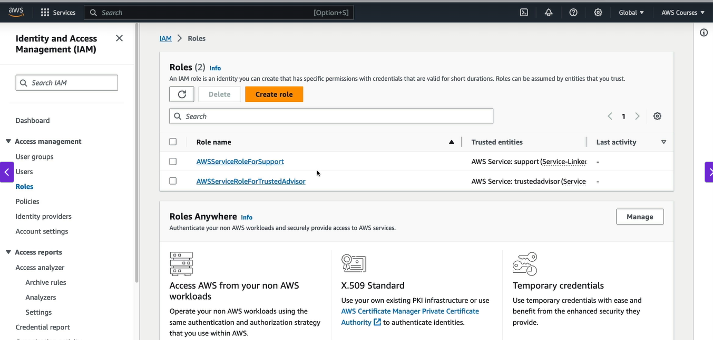

* select aws service : becuase we are creating role for serevice.

    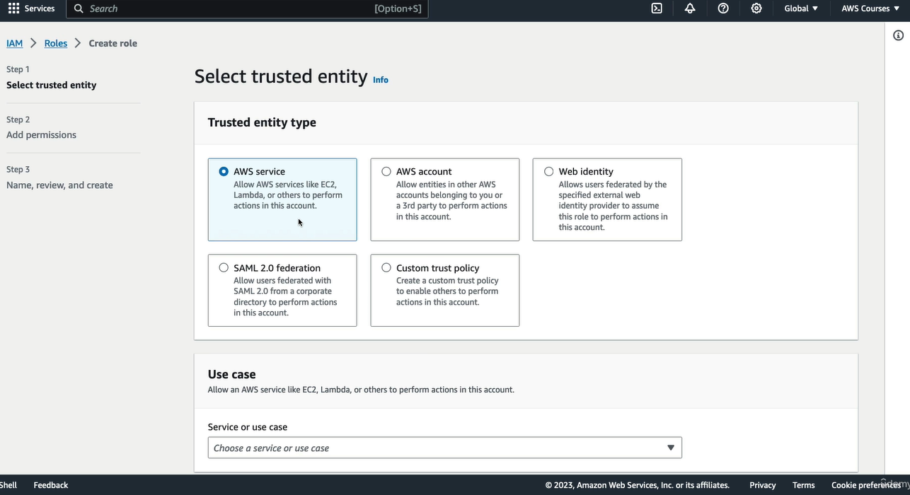

* in above image from in service and user dropdown select serivice for which role you are going to create.in ower case select EC2

    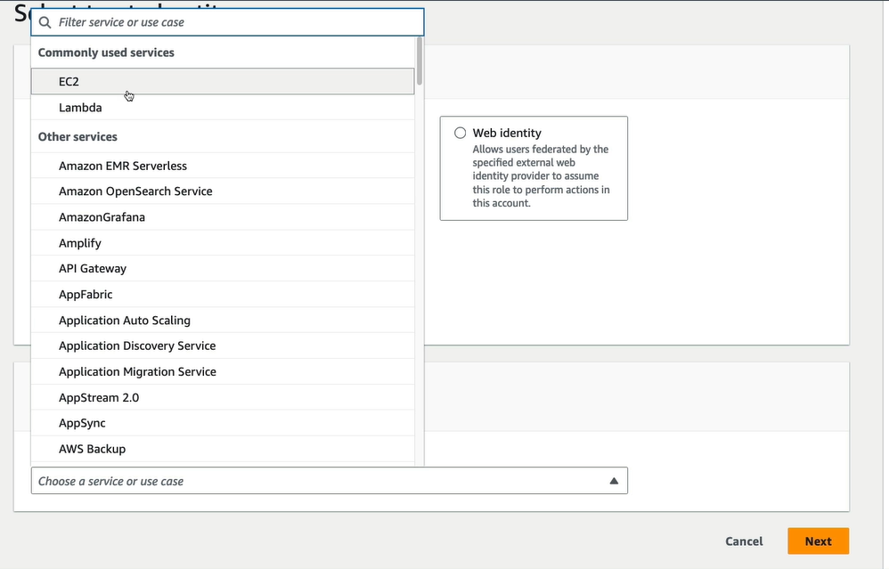

* chose use case EC2 on same above page 

* click on next

* attache policies with role.

    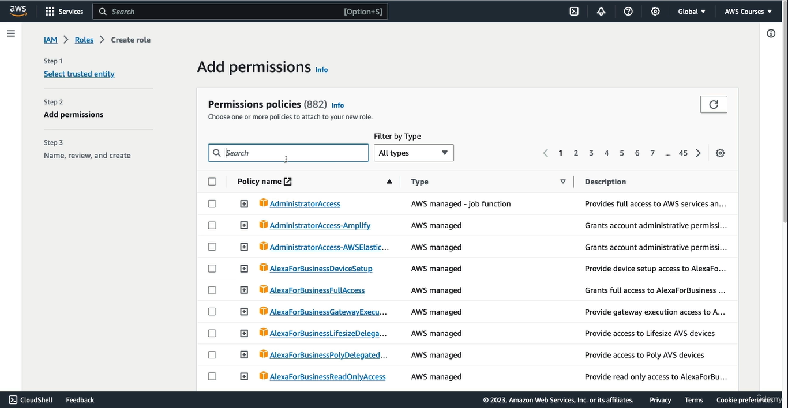

* Give role name

    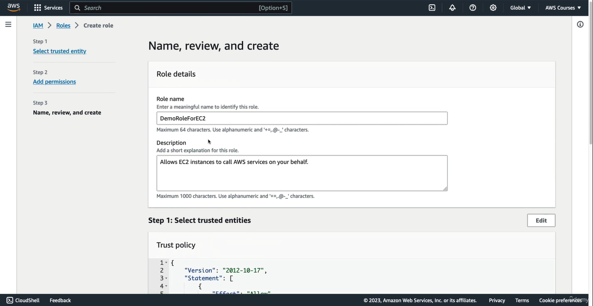


## Attache IAM Role to instance

- I have SSH into ec2 instance and i am trying to list all iam users. But is is giving below errors. Because currecnt EC2 instance does'nt have permission to show IAM user.In this can do below things.


    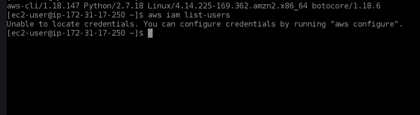

- We can not directly attache permision or polices to EC2 because it is not a IMA identity.

1. Instead we can provide AWS Access Key ID, AWS SECRETE KEY, of a IAM user whos have permission to show all users. But this is also not a good idea because  it stores secrets on the instance and can lead to misuse if leaked.. 

2. The best practice is to create a role and attache permission to show all iam user to that role  and assigne that role to ece2. This is the best and secure way to give your EC2 instance permissions
 
    - Go to Instance -> select a instance -> Action -> Security -> Modify Iam Role

        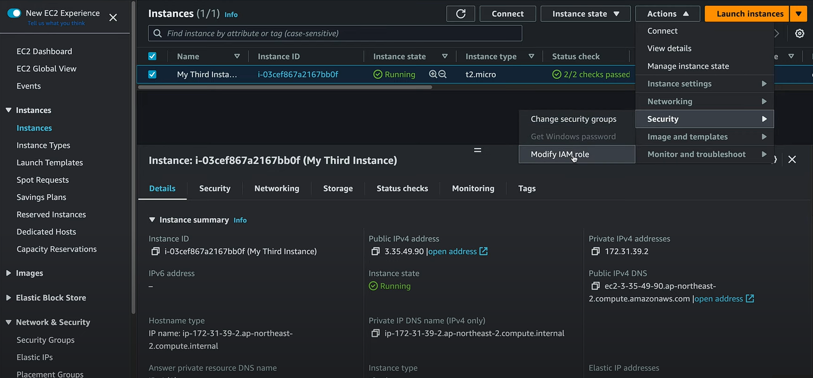

    - Select allready Created role from dropdown

        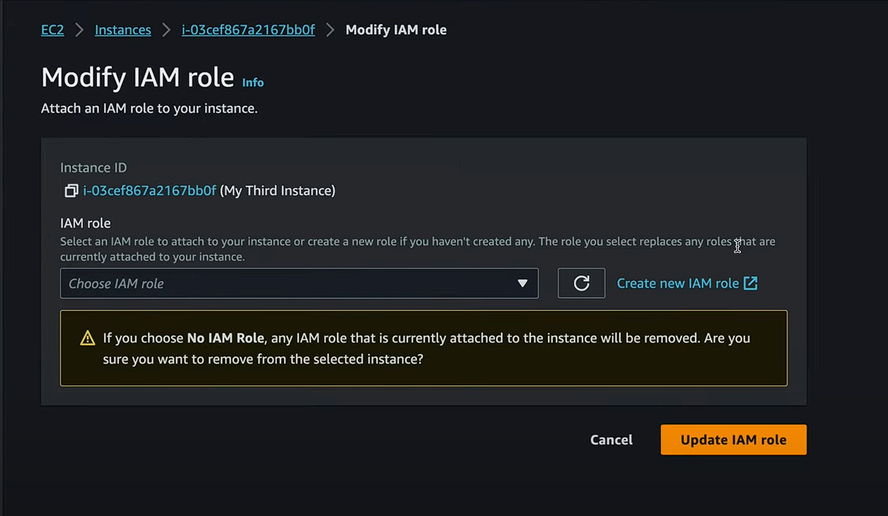

    - Select IAM Role and click on "Update Iam Role"

        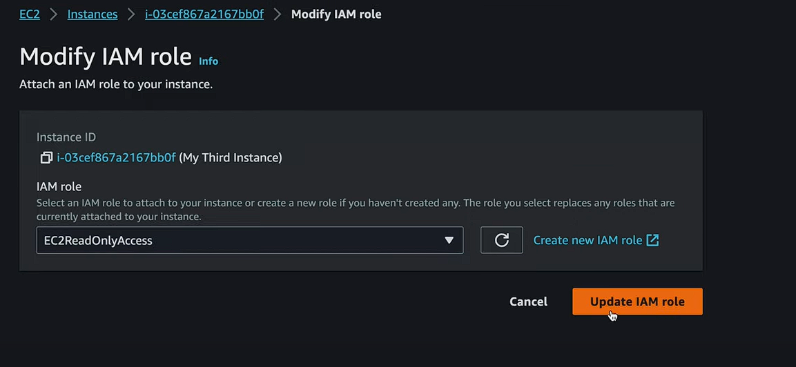


## EBS (Elastic Block Storage)

* An EBS volume is a network drive you can attach with your instances while they run.It is a network device means, to communicate between the instance and the EBS Volume,it will be using the network. Now, EBS Volumes, because they are a network drive they can be detached from an EC2 instance and attached to another one very quickly.

* It allows your instance to persist data, even after theri termination 

* They can mounted to one instance at time .but it is a very possible for us to have two EBS Volumes attached to one instance think of it as two network USB sticks into one machine

* They are bound to specific availbility zone. EBS Volumes are locked to a specific availability zones,that means that, as I said, if it's created in us-east-1a it cannot be attached to us-east-1b

- when we go ahead and create EBS Volumes through EC2 instances, there is this thing called a Deletes on Termination attribute. if you look at this when we create an EBS Volume in the console, when we create an EC2 instance there is the second to last column called Delete on Termination.And by default, it is ticked for the Root Volume and not ticked for a new EBS Volume. So this controls the EBS behavior when an EC2 instance is being terminated. So by default, as we can see, the root EBS Volume is deleted alongside the instance being terminated.

## EBS–optimized instances 

EBS–optimized instances are special EC2 instances that give extra, separate network capacity just for EBS (Elastic Block Store) storage.

Some instance types are EBS-optimized by default, and there is no need to enable it and no effect if you attempt to disable it. Other instance types optionally support EBS optimization and you can enable it during or after launch

The following instance types are EBS–optimized by default:

1. General purpose

2. Compute optimized

3. Memory optimized

4. Storage optimized

5. Accelerated computing

6. High-performance computing

## Amazon EC2 Fleet 

## Amazon EC2 Auto Scaling

## Change Instance Type of EC2
- change the instance type of an Amazon EBS-backed instance if the instance type that you need is compatible with the current configuration of your instance.
- ou must stop your instance before you can change its instance type

- When you stop and start an instance, we move the instance to new hardware. If your instance has a public IPv4 address, that is not an Elastic IP, we release the address and give your instance a new public IPv4 address 

- you can't change the instance type of a Spot Instance

- We recommend that you update the AWS PV driver package before changing the instance type

- when we stope entance which is autoscalling it treat that stope as a unhealthy and create new instance isteatd of that instance, to change the instance type of this type of isntance temporarily suspend autoscalling and then stop and change instance type.

## Migrate to new Instance

You can change the instance type of an EC2 instance only if it is an EBS-backed instance with a configuration that is compatible with the new instance type that you want. Otherwise, if the configuration or your instance is not compatible with the new instance type, or it is an instance store-based instance, you must launch a replacement instance that is compatible with the instance type that you want

- Steps require before migration
    1. Back up the data on the original instance.

    2. Launch a new instance with a configuration that is compatible with the new instance type that you want, attaching any EBS volumes that were attached to your original instance.

    3. Install your application on your new instance.

    4. Restore any data.

    5. If the original instance has an Elastic IP address, you must associate it with your new instance to ensure that your users can continue to use your application without interruption.


# Clock Sync Service

## NTP
NTP is a network protocol used to synchronize the clocks of computer systems over a network. It ensures that all systems have the same, accurate time if all server are on same network, even if they are in different geographic locations.

Most of the AMI comes with pre configured NTP IPv4 endpoint by default.No further configuration is required for instances launched from these AMIs unless you want to use the IPv6 endpoint. 

NTP and PTP connections do not require any VPC configuration changes, and your instance does not require access to the internet.

## PTP
 PTP (Precision Time Protocol) is a network-based time synchronization protocol defined in IEEE 1588. It is used to synchronize clocks with much higher precision than NTP, typically sub-microsecond accuracy.


## Using Amazon Public Time Sync Service in Hybrid Environments

You’re part of a tech company that runs a hybrid cloud environment. Web Servers (Apache/Nginx) runs on 	EC2 in AWS, Application Server	runs on EC2 in AWS, Database Server	runs On-premise in your office data center which is outside of aws.

Web servers in AWS receive user traffic.App server processes business logic.Database server is on-prem due to compliance reasons.Monitoring system checks metrics, logs, and alerts.

### Why Time Sync is Critical Here

Logs from AWS and on-prem need to line up properly for debugging.Monitoring & alerting systems compare timestamps from both AWS and on-prem systems.Database replication and transactions need accurate time across locations.

### Problem Without a Common Time Source

Your AWS EC2 instances use Amazon Time Sync (169.254.169.123), which is great.But your on-prem database and monitoring servers were syncing time from:A local NTP server or Or public NTP pool (e.g. pool.ntp.org)

A 2–3 second time drift occurs between your EC2 logs and on-prem logs.This causes confusing logs, incorrect alert timings, and failed token-based authentications

### Solution:
 Use time.aws.com on On-Prem Servers. You change your on-prem systems to sync time using:server time.aws.com iburst. Now All systems sync to Amazon's atomic time 


# Chanage the time zone of your instance 

Amazon EC2 instances are set to the UTC (Coordinated Universal Time) time zone by default. You can change the time on an instance to the local time zone or to another time zone in your network.

https://docs.aws.amazon.com/AWSEC2/latest/UserGuide/change-time-zone-of-instance.html


# Networking

## Virtual Network or Elastic Network Interface (ENI)

Virtual Network Interface is also known as  Elastic Network Interface (ENI).It is a Virtual Network Interface is a network card of an instance.ENI is necessory to for an instance to talk to another instance or machine.


## Network Card or Elastic Network Adapter

- Network Card is also known as NIC – Network Interface Card.It is a hardware device that connect your instance or server to network.For exampel when you connect wifi wire with your laptop to use internet that adapter is called Network card.This card send and recive data from or to network.

- In aws it is availbel in vertual form we call it elastic Network Interface (ENI) ya Virtual Network Interface.

- ENA (Elastic Network Adapter) is basically a virtual version of a Network Interface Card (NIC),

### NIC

A Network Interface Card (NIC) is a hardware component in a computer or server that enables it to connect and communicate with a network, such as a local area network (LAN) or the internet

- t can be a physical circuit board or chip built into the computer motherboard or added as an expansion card.

- It provides the physical interface(way to connect) for network connectivity, either wired (Ethernet cables) or wireless (Wi-Fi antenna)

- Each NIC has a unique MAC (Media Access Control) address used to identify the NIC device on the network.

    ### How NIC Works
    - The NIC acts as a bridge between the computer and the network
    - When the computer wants to send data (such as browsing a webpage), it passes the data to the NIC.
    - The NIC converts digital data from the computer into signals suitable for the network medium (electrical signals for cables, radio waves for Wi-Fi).
    - The NIC sends these signals over the network to the destination.
    - When the NIC receives data from the network, it converts the signals back into digital data for the computer to process.
    - It manages sending and receiving data packets, including detecting and handling errors and collisions on the network.
    - Enables the computer to communicate with other devices on the network
   ### Queue in ENA 
   -  A queue in ENA acts like a waiting line. When too many network packets arrive to be sent out or processed at once, they don’t get lost immediately; instead, they wait their turn in the queue.

   - This queuing helps avoid packet loss temporarily if the traffic burst is short-lived.

   - However, if queues become too long or persist, packets will eventually be dropped, which harms application performance.

   ### Metrics Capturing by ENA
   - ENA delivers detailed network performance metrics in real time to your EC2 instance.
   - Packets Sent and Received: Total number of packets successfully transmitted or received.
   - Packets Queued: Number of packets waiting in a queue before being sent or processed. A queue forms when network traffic exceeds the immediate processing capacity.
   - Packets Dropped: Number of packets discarded because they could not be sent or processed (e.g., due to bandwidth or PPS limits).
   - Bandwidth and PPS limits exceeded: Metrics that indicate when the instance is trying to send more data or packets per second than supported, leading to queuing or dropping.

   These metrics help monitor network health, troubleshoot performance bottlenecks, and optimize resource usage.

# Enhence Networking

- Enhanced Networking is a  AWS feature that gives  high-performance network speed data to instance.This feature uses SR-IOV (Single Root I/O Virtualization) technology.Enhanced networking provides higher bandwidth, higher packet per second (PPS) performance, and consistently lower latency between instances.There is no additional charge for using enhanced networking.

- Enhenced Networking is a way to access the existing NIC more efficiently. It’s only available on certain EC2 instance types and supported AMIs

- Enhanced networking provides higher bandwidth, higher packet per second (PPS) performance, and consistently lower latency between instances. There is no additional charge for using enhanced networking.

 


### Enhanced Networking is made possible by two key technologies
- network interface cards (NICs)
- SR-IOV (Single Root I/O Virtualization)


## SR-IOV
SR-IOV allows a single physical NIC to be virtualized(converted) into multiple hysical Function (PF).Virtual Functions (VFs) is a mini virtual NICs that can be directly assigned to virtual machines (like EC2 instances). 

## How does SR-IOV and Enhanced Networking reduce network latency?

### Without Enhanced Networking
-  EC2 instance sends data , This data first goes to Hypervisor (host OS).Host OS menas physical data center of aws. Then at host machine Hypervisro process this data like security, routing, etc.Then data is sent to the NIC of host machine, then NIC sends that data to destination machine or internet.

Here problem is every time data is sent to the host machine that takes lots of time .That increase latancy.

### With Enhanced Networking

- AWS assined an VF vtirtual function , that veritural function is a part of NIC of hsot machine . Now VF can send data directly to the NIC of the host machine . Previously data was sent to the host machine then host machine was sending to Nic fo hsot machine and then NIC sent to destination .


# EBS 

Amazon EBS provides durable, block-level storage(means just like hard-drive devided into chunks) volumes that you can attach and detach from your instances. You can attach multiple EBS volumes to an instance.When we attach an EBS with instance both exist independently.

To keep a backup copy of your data, you can create snapshots from your EBS volumes. Snapshots are stored in Amazon S3. You can create an EBS volume from a snapshot.

When we create an instance we get storage but that storage is temporary storage. When instace stop or hibernate all data on that storage will be earased.

Amazon EFS provides scalable, fully managed file storage in the cloud.It’s designed for Linux EC2 instances only (right now).Think of it as a shared file system that multiple EC2 instances can use at the same time.


* Consistent bandwidth → The speed of data transfer doesn’t suddenly slow down or spike; it stays steady over time.

- Predictable bandwidth → You can expect the same performance every time, without surprises.

- IOPS = Input/Output Operations Per Second → How many read/write actions your storage (EBS volume) can do in 1 second.

- Before attaching EBS with EBS we should consider wether we need more storage or we need EBS that will have fast I/O operation between ec2 and EBS.

- For consistent and predictable bandwidth use cases, use Amazon EBS-optimized instances with General Purpose SSD volumes or Provisioned IOPS SSD volumes

- For maximum performance, match the IOPS you have provisioned for your volumes with the bandwidth available for your instance type. 
    * Provisioned IOPS →This means you are explicitly telling AWS:"I want my volume to be able to do, for example, 5,000 IOPS."

- for temporary storage we use isntacne storage and for permanenet storage we use EBS

### What is RAID?

- RAID stands for Redundant Array of Independent Disks.
- It is a way to combine multiple EBS volumes together into one logical unit to improve performance, reliability, or storage capacity.

    * Example of use cases:
        - Combine 4 EBS volumes to get faster speed (parallel read/write).

        - Combine volumes to get fault tolerance (if one fails, data is still safe).
- An array is a group of multiple volumes combined together in RAID

- If you create a RAID array with more than 8 volumes (e.g., 10, 12, or more) You may see that performance doesn’t increase proportionally.
    * Why?
        - Every extra volume added introduces more overhead for the system to manage I/O operations (like reading/writing data).

        - Managing many volumes (more than 8) causes the system to spend extra time coordinating them This is called I/O overhead.


## Nitro System
- The Nitro System is a collection of hardware and software components designed by AWS.

    * Its job is to:
        - Provide high performance.
        - Increase security.
        - Improve efficiency for EC2 instances.

- Dedicated EBS Volume Limit
    * Means the instance has a separate, fixed amount of bandwidth reserved only for EBS traffic.
    * Example:An instance might get 1,000 Mbps just for EBS, separate from its network bandwidth.
    * Benefit:Your EBS performance is stable and predictable Doesn’t compete with network or other traffic.

- Shared EBS Volume Limit

    * Means the EBS bandwidth is shared with other network activities (like internet traffic).
    * Problem : If the instance does a lot of network traffic (e.g., web serving), EBS performance may drop sometimes.

## dedicated EBS volume limit
The volume limits for instances built on the Nitro System depend on the instance type. Some Nitro instance types have a dedicated EBS volume limit, while most have a shared volume limit.

*  Dedicated EBS Volume Limit

    - Certain Nitro instance types have a dedicated limit for EBS volumes.

        This means:The number of EBS volumes you can attach is independent of other attachments (like network interfaces or NVMe instance store volumes).

        there will be limit for EBS seperate other then network interface and NVMe

* hared EBS Volume Limit

    - In this there will be Limitation on combinatino of EBS+Network interface+NVMe
    for exmaple lets say we have 28 limit so if there is 10 (network interface+NVMe) then we have only 18 for EBS

## Amazon EC2 User Guide Root volumes for your Amazon EC2 instances

- It store OS 
- Boot :The process of starting a computer or an EC2 instance and loading the operating system (OS) so that it becomes ready for use

- When you launch an instance, we create a root volume for the instance. The root volume contains the image used to boot the instance. Each instance has a single root volume. You can add storage volumes to your instances during or after launch.The AMI that you use to launch an instance determines the type of root volume. You can launch an instance from either an Amazon EBS-backed AMI (Linux and Windows instances) or an instance store-backed AMI (Linux instances only). There are significant differences between what you can do with each type of AMI.


## Keep an Amazon EBS root volume after an Amazon EC2 instance terminates

By default, the Amazon EBS root volume for an instance is deleted when the instance terminates. You can change the default behavior to ensure that an Amazon EBS root volume persists after the instance terminates. To change the default behavior, set the DeleteOnTermination attribute to false. You can do so either at instance launch or later on.

### Configure the root volume to persist during instance launch
- Open the Amazon EC2 console at https://console.aws.amazon.com/ec2/.

- In the navigation pane, choose Instances and then choose Launch instances.

- Choose an Amazon Machine Image (AMI), choose and instance type, choose a key pair, and configure your network settings.

- For Configure storage, choose Advanced.

- Expand the root volume.

- For Delete on termination, choose No.

- When you are finished configuring your instance, choose Launch instance.

### configure the root volume to persist for a running instance

You can change the configuration of the root volume while the instance is running →
Specifically, you can set the "DeleteOnTermination" attribute to false →
So that the root volume does NOT get deleted when the instance is terminated

- Note that you can't complete this task using the Amazon EC2 console.

- Use the modify-instance-attribute command with a block device mapping that sets the DeleteOnTermination attribute to false.

- aws ec2 modify-instance-attribute \
    --instance-id i-1234567890abcdef0 \
    --block-device-mappings file://mapping.json

## block device mappings

A block device mapping defines the block devices (instance store volumes and EBS volumes) to attach to an instance. You can specify a block device mapping as part of creating an AMI so that the mapping is used by all instances launched from the AMI. Alternatively, you can specify a block device mapping when you launch an instance, so this mapping overrides the one specified in the AMI from which you launched the instance.

### Block device mapping entries
- When you create a block device mapping, you specify the following information for each block device that you need to attach to the instance:

- Device Name

    * Example: /dev/xvda, /dev/xvdb

    * Inside the instance, Linux assigns the volume a name (driver may rename it).

    * The name in AWS might not exactly match the name inside the instance

- Instance Store Volumes

    * These are temporary storage volumes physically attached to the host.

    * You specify: Virtual device name → ephemeral0 to ephemeral23

    * Note:
        - Number & size of instance store volumes depends on the instance type.

        - NVMe instance store volumes are automatic → AWS enumerates them, so including them in BDM does nothing.

- For EBS volumes, you need to provide more details:

    * Snapshot ID (optional). Example: snap-0abcd1234efgh5678.This tells AWS which snapshot to use to create the volume.You can skip it if you specify the volume size.

    * Volume Size (in GiB)

        - Must be ≥ snapshot size if you are using a snapshot.Example: Snapshot is 20 GiB → Volume size can be 20 GiB or more.

    * Delete on Termination

        - Do you want this volume to be deleted when the instance is terminated?

        - Root volume → default = true

        - Additional volumes → default = false

        - AMI inherits this setting from the instance, and new instances inherit it from the AMI.

    * Volume Type

        - gp2 / gp3 → General Purpose SSD

        - io1 / io2 → Provisioned IOPS SSD (high-performance)

        - st1 → Throughput Optimized HDD (for large sequential workloads)

        - sc1 → Cold HDD (for infrequent access)

        - standard → Magnetic disk (legacy)

    * IOPS (Input/Output Operations Per Second)

        - Only for io1 or io2 volumes.

        - Determines how fast the disk can handle read/write operations.

- Some instance types include more instance store volumes than others, and some instance types contain no instance store volumes at all. If your instance type supports one instance store volume, and your AMI has mappings for two instance store volumes, then the instance launches with one instance store volume.

- You cannot add instance store volumes to an instance that is already running if it did not ttached  them at launch.You can not stop the instance(like t2.micro which dose not support instance store) and Change the instance type to i3.large (which supports instance store) and then Restart Instance store volumes will not appear.because Instance store volumes must be attached at launch, not later

- If you launch an EC2 instance with instance store volumes mapped, and then change the instance type to one that supports fewer instance store volumes, the original mappings still appear in the metadata, but the instance can only use the number of volumes that the new instance type supports.

- Depending on instance store capacity at launch time, M3 instances may ignore AMI instance store block device mappings at launch unless they are specified at launch. You should specify instance store block device mappings at launch time, even if the AMI you are launching has the instance store volumes mapped in the AMI, to ensure that the instance store volumes are available when the instance launches


### There are two ways to specify volumes in addition to the root volume when you create an AMI.

- f you've already attached volumes to a running instance before you create an AMI from the instance, the block device mapping for the AMI includes those same volumes. For EBS volumes, the existing data is saved to a new snapshot, and it's this new snapshot that's specified in the block device mapping. For instance store volumes, the data is not preserved.


## Torn Write Problem

Normally, when data is written to disk, it happens in multiple small steps (called I/O operations).Sometimes, if there is a power failure or system crash during a write, only part of the data gets written → this is called a torn write.

### AWS Torn Write Prevention

AWS designed Torn Write Prevention specifically for block storage (EBS volumes).It helps prevent the torn write problem by making sure that every write to the disk is complete or doesn’t happen at all.This ensures data consistency even in case of a sudden failure.

Torn Write Prevention in AWS helps prevent partial or incomplete writes to block storage (EBS) that can cause data corruption in relational databases.It’s especially useful for databases like MySQL and MariaDB that use InnoDB or XtraDB engine, which perform a lot of small disk operations.This feature improves performance and ensures data reliability during unexpected failures.

- In relational databases (like MySQL and MariaDB), data is stored in pages (small blocks of data).Sometimes, if the power fails or the OS crashes while writing a page, only part of the page gets written → this is called a torn write.Torn writes can corrupt the database

- MariaDB and MySQL use a mechanism called a doublewrite buffer.ItFirst, database writes data to the doublewrite buffer file. Then, from the doublewrite buffer, data is written to the real database table (data pages).if the write gets interrupted halfway, the database can recover the correct data from the doublewrite buffer during restart.

    * Problem with This Approach
        - Writing data twice
        - First to the doublewrite buffer, and Then to the real data files.
        - This causes extra I/O operations
        - Database becomes slower
        - ncreased latency
        - Fewer transactions processed per second.
    * Due to above problems Torn Write Prevention Is Better


## ENA queues

In AWS EC2 instances, ENA (Elastic Network Adapter) is used for high-performance networking. Inside ENA, there are queues that handle sending and receiving network packets

ENA queues are allocated to network interfaces with default static limits based on the instance type and size

There can be multiple ENI(elastic network interface) in a instance and also there can be multiple ENA queues. Lets say we chosed a instance type which has 2 ENI and 16 ENA. so we can distribute these 16 ENA to both 2 ENI and this distribution we can decide that is called dynamic distribution. By default aws destribute tese ENA Que to ENI that is called static distribution.

### Modify the number of queues

You can modify the number of ENA queues using AWS Management Console or AWS CLI. In the AWS Management Console, the ENA queues configuration is available under each Network interface setting.


## Monitor network performance for ENA

The Elastic Network Adapter (ENA) driver make availble network performance metrics from the instances on which ENA is anable.You can use these metrics to troubleshoot instance performance issues, choose the right instance size for a workload, plan scaling activities proactively, and benchmark applications to determine whether they maximize the performance available on an instance.

Amazon EC2 sets a maximum limit for each instance type on how much networking it can handle.It means AWS wants no single EC2 instance to hog all the network resources, so that other instances on the same hardware or in the same account/region also get fair performance.

Imagine a scenario,You have multiple instances running on the same server or VPC,Instance A → handles streaming video,nstance B → handles database replication,Instance C → handles background jobs,If Instance A could use unlimited network It might use all available bandwidth,Instance B and C will get very slow network,Overall system performance becomes inconsistent.So AWS defines network maximums per instance type,So even if Instance A is very network-intensive, it can only use up to its allowed maximum,Instance B and C still get their share,This ensures consistent network performance across all instances

- Every EC2 instance has a maximum network bandwidth limit, which depends on its instance type and size. This limit applies to the total amount of traffic going in and out of the instance combined. For example, if an instance has a 10 Gbps limit, the sum of its inbound and outbound traffic cannot exceed that limit. Some EC2 instances don’t get a fixed bandwidth all the time(means the instance’s network speed is not constant — it changes based on usage and available credits)instead, they use a network I/O credit system. In this model, the instance earns credits when it uses less bandwidth, and it can use those credits later to temporarily burst to higher speeds when needed. Apart from these limits, AWS also sets maximum bandwidth for traffic going to the internet and AWS Direct Connect. This ensures consistency, fairness, and reliable performance across different workloads and network paths.

- Packet-per-second (PPS) performance – Each EC2 instance has a maximum PPS performance, based on instance type and size.

- Connections tracked  :When an EC2 instance communicates with another system—like a user, database, or another server—a connection is created. The security group keeps track of each of these connections so that when a response or return data comes back, it knows exactly where to send it. But each instance can only track a limited number of these connections at the same time. If too many connections happen at once, the instance may hit its tracking limit

- Each network interface(like ENI) of a EC2 instance can send only a certain maximum number of packets per second (PPS) to local AWS services like DNS, instance metadata, and time sync.

- When the network traffic for an instance exceeds a maximum, AWS shapes the traffic that exceeds the maximum by queueing and then dropping network packets. You can monitor when traffic exceeds a maximum using the network performance metrics. These metrics inform you, in real time, of impact to network traffic and possible network performance issues.


## Network Latancy improvement

Network latency is the amount of time it takes for a packet of data to travel from its source to its destination. High network latency can lead to various issues, such as the following:
- Slow load times for web pages
- Video stream lag
- Difficulty accessing online resources

### steps that you can take to improve the network latency on Amazon EC2 instances that run on Linux

- Reduce the number of network hops for data packets:- here are two ways to reduce network hops for your Amazon EC2 instances,
 1. Cluster placement group – When you specify a cluster placement group, Amazon EC2 launches instances that are in close proximity to each other, physically within the same Availability Zone (AZ) with tighter packing. The physical proximity of the instances in the group allows them to take advantage of high-speed connectivity, resulting in low latency and high single flow throughput.

 2. Dedicated Host – A Dedicated Host is a physical server that's dedicated for your use. With a Dedicated Host, you can launch your instances to run on the same physical server. Communication between instances that run on the same Dedicated Host can happen without extra network hops.

    - Dedicated host: A physical machine (aws data center) where EC2 instacne run.

- Linux kernel configuration increase or dicrease latancy:- Linux kernel configuration can increase or decrease network latency. To achieve your latency optimization goals, it's important to fine-tune the Linux kernel configuration according to the specific requirements of your workload.

- Enable busy poll mode – Busy poll mode reduces latency on the network receive path. When you enable busy poll mode, the socket layer code can directly poll the receive queue of a network device. The downside of busy polling is higher CPU usage in the host that comes from polling for new data in a tight loop. There are two global settings that control the number of microseconds to wait for packets for all interfaces.

    - Busy poll mode helps reduce network delay by constantly checking for new incoming data directly on the network device, instead of waiting for an interrupt to tell the CPU new data has arrived.

    busy_poll: This controls how long (in microseconds) the system will actively poll (check) the network device for new packets on poll() or select() system calls. Essentially, it lets the CPU keep checking for new network data instead of waiting for an interrupt, reducing latency but increasing CPU usage. The recommended value is typically between 50 to 100 microseconds, depending on how many sockets are involved.

    busy_read: This controls how long (in microseconds) the system will actively poll for packets specifically during socket read() operations. It is similar to busy_poll but is focused on reading packets directly when a blocked socket is trying to fetch incoming data. A common recommended value is 50 microseconds.


# Placement Group

A cluster placement group is a logical grouping of instances within a single Availability Zone. Instances are not isolated to a single rack instead it is placed in different rack so that when one rack goes dow other instance still work.

    - a rack is a physical metal frame that holds multiple servers (computers) stacked one above another.
    |------------------|
    |  Server Machine  |
    |------------------|
    |  Server Machine  |
    |------------------|
    |  Server Machine  |
    |------------------|
    |  Server Machine  |
    |------------------|

 cluster placement group can span peered virtual private networks (VPCs) in the same Region.
  - The instances in the placement group can be placed across two different VPCs, as long as those VPCs are peered (connected) and in the same AWS Region

nstances in the same cluster placement group enjoy a higher per-flow throughput limit for TCP/IP traffic and are placed in the same high-bisection bandwidth segment of the network.

Cluster placement groups are recommended for applications that benefit from low network latency, high network throughput, or both. They are also recommended when the majority of the network traffic is between the instances in the group. To provide the lowest latency and the highest packet-per-second network performance for your placement group, choose an instance type that supports enhanced networking.

### We recommend that you launch your instances in the following way:

- Use a single launch request to launch the number of instances that you need in the placement group.

- Use the same instance type for all instances in the placement group.

If you try to add more instances to the placement group later, or if you try to launch more than one instance type in the placement group, you increase your chances of getting an insufficient capacity error.

If you stop an instance in a placement group and then start it again, it still runs in the placement group. However, the start fails if there isn't enough capacity for the instance

If you receive a capacity error when launching an instance in a placement group that already has running instances, stop and start all of the instances in the placement group, and try the launch again. Starting the instances may migrate them to hardware that has capacity for all of the requested instances

A cluster placement group can't span multiple Availability Zones.

The maximum network throughput speed of traffic between two instances in a cluster placement group is limited by the slower of the two instances. For applications with high-throughput requirements, choose an instance type with network connectivity that meets your requirements.

    limited by the slower of the two instances(Bleow is meaning of this line)
        - Instance A supports 25 Gbps network speed

        - Instance B supports 10 Gbps network speed

        -Then their communication speed will be limited to 10 Gbps, because Instance B is the slower one.


# Instance Toplogy

In AWS, instance topology is basically special metadata that tells you where your EC2 instance is physically or logically located within the AWS infrastructure. It includes details like which Availability Zone, which rack or host, or which partition (if using placement groups) your instance is running on. This information may not seem important at first, but it becomes very useful when running high-performance computing (HPC), machine learning, or any workload that involves multiple instances communicating with each other. If you know which instances are physically close to each other, you can group them together for faster communication and lower network latency, instead of randomly using instances that might be far apart. So while topology is technically just metadata, it plays a big role in optimizing performance, minimizing failures, and intelligently scheduling workloads.

You can use instance topology to detect the location of your existing instances, but you can't use it to choose to launch a new instance physically close to an existing instance.

- Instance topology views are only available for instances in the running state.

- Each instance topology view is unique per account.

- The AWS Management Console does not support viewing the instance topology.

# VPC 


Amazon Virtual Private Cloud (Amazon VPC) enables you to define a virtual network in your own logically isolated area within the AWS cloud, known as a virtual private cloud or VPC. You can create AWS resources, such as Amazon EC2 instances, into the subnets of your VPC. Your VPC closely resembles a traditional network that you might operate in your own data center, with the benefits of using scalable infrastructure from AWS. You can configure your VPC; you can select its IP address range, create subnets, and configure route tables, network gateways, and security settings. You can connect instances in your VPC to the internet or to your own data center.

### Default VPC

When you create your AWS account, we create a default VPC in each Region. A default VPC is a VPC that is already configured and ready for you to use. For example, there is a default subnet for each Availability Zone in each default VPC, an internet gateway attached to the VPC, and there's a route in the main route table that sends all traffic (0.0.0.0/0) to the internet gateway. You can modify the configuration of your default VPCs as needed. For example, you can add subnets and route tables.


# Security 

## AWS 
AWS responsible to secure infrastrure where you deploy your application

## User
esponsible for maintaining control over your content that is hosted on this infrastructure. You are also responsible for the security configuration and management tasks for the AWS services that you use. 

- For data protection purposes, we recommend that you protect AWS account credentials and set up individual users with AWS IAM Identity Center or AWS Identity and Access Management (IAM).

- Use multi-factor authentication (MFA) with each account.

- Use SSL/TLS to communicate with AWS resources.

- Set up API and user activity logging with AWS CloudTrail

- Use AWS encryption solutions, 

## Outpost

An Outpost is basically AWS hardware (a mini data center) that AWS installs in your own location (like your office, factory, or local data center).It extends AWS services (like EC2, EBS, RDS) closer to you, but it’s still connected to the main AWS Region.Even though Outposts run locally, they need to talk to the parent AWS Region (like Mumbai region, N. Virginia, etc.) for updates, monitoring, control, and some services.For this, AWS creates special network connections called service links.In addition to service links, you can connect your Outpost to your own VPC (Virtual Private Cloud) inside the AWS Region.This allows your Outpost instances to act like they are inside your cloud network, so they can securely talk to other AWS resources like databases, S3, or other EC2 instances in the Region.


AWS ensures that any traffic traveling between your Outpost ↔ AWS Region or Outpost ↔ your VPC subnet is end-to-end encrypted.

## Controlling network traffic

- Restrict access to your instances using security groups.Security Group is stateful (if you allow inbound traffic, the response is automatically allowed outbound).
- Use network ACLs (not always, only when needed). They are stateless (every rule must be defined for both inbound and outbound separately).They work at the subnet level, not per instance.
    * When NACLs are useful:- To block a specific type of traffic (like deny one suspicious IP range).To protect in case an instance is launched without the right security group.

- Windows Firewall: Windows Firewall (inside instance) is extra firewall, controls traffic inside the OS.Security Groups is main AWS firewall, controls traffic at the AWS level.You can use both together.Security groups Allow only certain ports from the internet (e.g., allow port 80/443 for web).Windows Firewall Block/allow specific apps, users, or IPs inside the server.

- Use private subnets for your instances if they should not be accessed directly from the internet. Use a bastion host or NAT gateway for internet access from an instance in a private subnet.

- Configure Amazon VPC subnet route tables with the minimal required network routes. Keep your VPC route tables simple — add only the routes you really need.If an instance needs internet access, put it in a subnet with a route to the Internet Gateway.If an instance needs to connect to your on-premises/internal network, put it in a subnet with a route to the Virtual Private Gateway.Don’t give unnecessary routes to instances that don’t need them.

- Use AWS Virtual Private Network or AWS Direct Connect to establish private connections from your remote networks to your VPCs. 

- Use VPC Flow Logs to monitor the traffic that reaches your instances.

## Update managerment

- You can use AWS Systems Manager Patch Manager to automate the process of installing security-related updates for both the operating system and applications.

- For EC2 instances in an Auto Scaling group, you can use the AWS-PatchAsgInstance runbook to help avoid instances that are undergoing patching from being replaced.

## Amazon EC2 key pairs and Amazon EC2 instances
- A key pair, consisting of a public key and a private key, is a set of security credentials that you use to prove your identity when connecting to an Amazon EC2 instance. For Linux instances, the private key allows you to securely SSH into your instance.

- Amazon EC2 stores the public key on your instance, and you store the private key,

- ou can specify the same key pair for all your instances or you can specify different key pairs.

- The public key that you specified at launch is placed on your Linux instance in an entry within ~/.ssh/authorized_keys

# Security Group
- A security group acts as a virtual firewall for your EC2 instances to control incoming and outgoing traffic

- Inbound rules control the incoming traffic to your instance, and outbound rules control the outgoing traffic from your instance.

- When you launch an instance, you can specify one or more security groups.

- If you don't specify a security group, Amazon EC2 uses the default security group for the VPC

- There is no additional charge for using security groups.

- You can associate each instance with multiple security groups, and you can associate each security group with multiple instances.

- You add rules to each security group that allow traffic to or from its associated instances. You can modify the rules for a security group at any time.

- When you create new and modified rules are automatically applied to all instances that are associated with the security group. When

- If there is more than one rule for a specific port, Amazon EC2 applies the most permissive rule. For example, if you have a rule that allows access to TCP port 22 (SSH) from IP address 203.0.113.1, and another rule that allows access to TCP port 22 from anywhere, then everyone has access to TCP port 22.

- You can specify security groups for your Amazon EC2 instances when you launch them. After you launch an instance, you can add or remove security groups. You can also add, remove, or edit security group rules for associated security groups at any time.

- Your security groups use connection tracking, which means they keep a memory of the traffic going in and out of your instance. Based on this memory, rules are applied to decide if the traffic should be allowed or blocked. Because of this, security groups are called stateful.This means that if traffic comes inside, then its reply can automatically go outside without needing a special outbound rule. And if traffic goes outside, it can automatically come back inside without needing a special inbound rule. In short — if something goes out, it’s allowed to return back, even if no rule is written for it.

- For protocols other than TCP, UDP, or ICMP (like some uncommon network protocols), the security group does not track full details — it only remembers the IP address and protocol number.Now, if your instance sends traffic to another host, and that host sends the same type of traffic back within 600 seconds (10 minutes), then your instance’s security group will allow it, even if there is no inbound rule written.

- Not all traffic is automatically remembered(saved) by security groups. f a security group allows all outbound TCP or UDP traffic (to anywhere) and also allows all inbound reply traffic (from anywhere on any port), then AWS does not keep track of this traffic like it usually does.For this kind of traffic, the replies are allowed only if the security group rules themselves allow it, not because AWS remembers the original connection.
