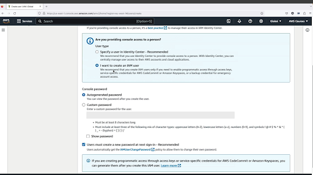
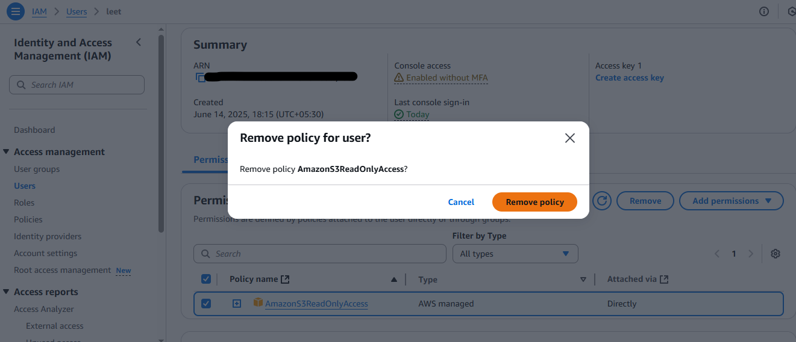
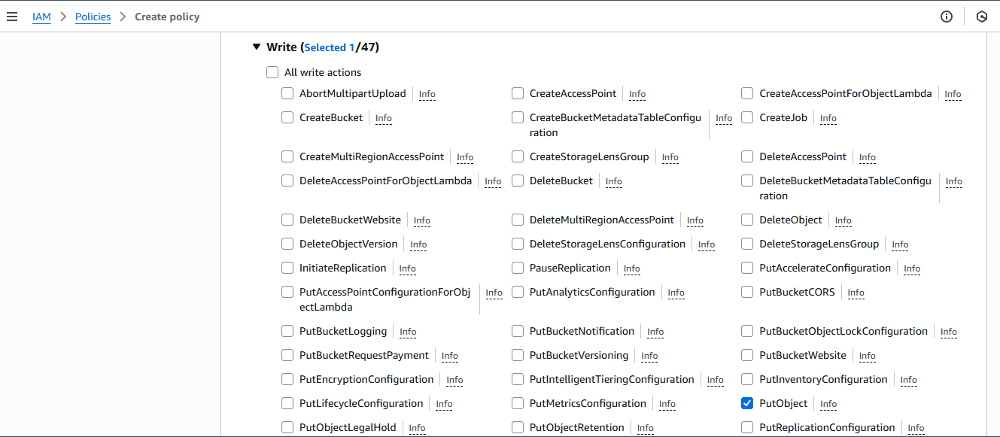
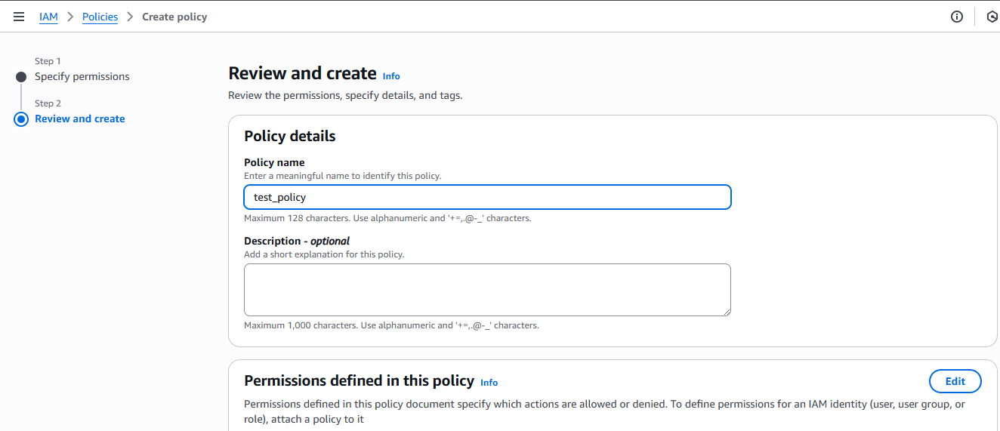

## created a IAM user and attached polycies to ReadOnlyAcccess of s3.

#### Go to console  Then search for IAM service

#### Go to "Access management"->"Users"

#### Click on create user

#### Fill user information and password etc.

#### Set permission 

#### Create a group

#### Enter name of group and select policies 

#### Now add that user to above created group

## remove AmazoneS3ReadOnlyAccess from above created user

### Go to ->IAM -> User  and chose user . then got to permission and select polycies you want to delete

###  Click on Remove

### Then click on remove policy

## create group and attached  policy to the group and later add above created user to the group

### Create a group

#### Enter name of group and select policies 

#### Now add that user to above created group

## IAM policies structure

## create custom managed polycies and attached that to a user

### Go to IAM->Policies

### Create Policies

### select service on which permissions will be applied

### click on write dropdown. Because we want to give write permision to that policy

### Select puObject permision checkbox becuase we want to allow upload object in a bucket

### Then specify ARN of a bucket on whcih you want to apply this policy

### specify policy Name

### Click on Create Policy

## created custome policy for s3 (to upload object) becuase ther is no managed policy for upload object. and then added that polycies to the group.

### GO to IAM -> User Groups and then click on a  Group and then go to permission and search selected policy

## Create Role to access s3 from EC2

### Go to IAM -> Role  and Create Role

### Slect trusted Entity (our trusted entity is EC2)

### Select Service

### Attach Policies to Role and click on Next

### Give Name to the Role

### we can see json representation policies

### Click on Create

