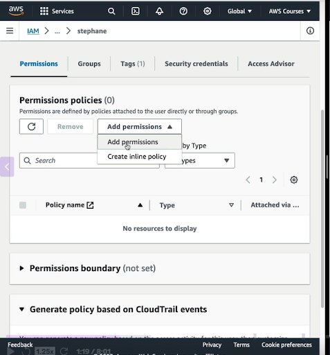
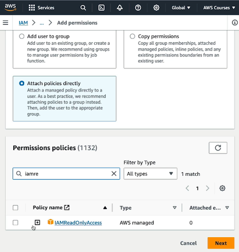

# AWS
# Root user
The AWS account root user is an AWS account principal that is created when your AWS account is established. The root user has access to all AWS services and resources in the account

# IAM user

By default, a new IAM user has no permissions to do anything.n IAM user is a resource in IAM that has associated credentials and permissions. An IAM user can represent a person or an application that uses its credentials to make AWS requests. This is typically referred to as a service account.

# Access key
Access keys: Used to make programmatic calls to AWS. However, there are more secure alternatives to consider before you create access keys for IAM users.If the IAM user has active access keys, they continue to function and allow access through the AWS CLI, AWS API, or the AWS Console Mobile Application.

# IAM service
AWS Identity and Access Management is a powerful tool for securely managing access to your AWS resources. One of the primary benefits of using IAM is the ability to grant shared access to your AWS account. Additionally, IAM allows you to assign granular permissions . This level of access control is crucial for maintaining the security of your AWS environment. IAM also provides several other security features. You can add multi-factor authentication (MFA) for an extra layer of protection, and user identity federation . IAM also integrates with AWS CloudTrail. By taking advantage of these capabilities, you can help ensure that access to your critical AWS resources is tightly controlled and secure

## shared access to your AWS account 

It means letting other people or systems use parts of your AWS account, but in a controlled and secure way — without giving them full access.like root user create IAM user and give only few permission to perform action.SO heere root user and IAM user are sharing account

## Multi Factor Atuthentication
You can add two-factor authentication to your account and to individual users for extra security. With MFA you or your users must provide not only a password or access key to work with your account, but also a code from a specially configured devic

## Granular permissions
Granular permissions means granting very specific, fine-tuned access to AWS resources rather than giving broad or unrestricted privileges. Instead of allowing a user to perform all actions (like AdministratorAccess), you define exactly what they can and cannot do.

## AWS CloudTrail
AWS CloudTrail is a service in Amazon Web Services (AWS) that records and monitors activity in your AWS account. It gives you visibility into what actions were taken, by whom, and when.AWS CloudTrail is a service in Amazon Web Services (AWS) that records and monitors activity in your AWS account. It gives you visibility into what actions were taken, by whom, and when.

CloudTrail logs every API call and event made in your AWS account, including:
1. Who made the request (user, role, service)
2. What action was taken (e.g., CreateInstance, DeleteBucket)
3. When it happened
4. From where (IP address)
5. Whether the request succeeded or failed

# administrators are responsible for

* managing IAM identities (users, groups, roles)
* Defining policies involves 
    1. Writing IAM policies (JSON rules)
    2. Assigning predefined AWS managed policies
* Enabling MFA for extra security
* Monitoring access with IAM Access Analyzer and CloudTrail.

# when do we use IAM

* You use IAM every time you access your AWS account

* It is used to control the access to AWS resources.We can manage permission which controls which resource can use a user.
* A user or group of users can be assigned json documents called policy.

* Above policies define permissions for a user of a group.
* In AWS we provide the least privilege principle; it means don’t give more permission to a user then needs.

## what is policies
Policies is cobinatino of many permision.form example AdministrativeAccess policy is set of below permisions.

```
"Action": * (allow all action)
"Resource": * (on all resource)
```
#### Below are permission of IAMReadOnlyAccess Policy


## AWS IAM Identity Center

IAM identities include IAM users, IAM groups, and IAM roles. An IAM entity is a type of identity that represents a human user or programmatic workload that can be authenticated and then authorized to perform actions in AWS accounts

###  Imagine your company has 5 AWS accounts.You don’t want to manually create users and permissions in each account.

#### So, you use IAM Identity Center (a central place) to:
* Create users and groups
* Give them access to multiple AWS accounts
* Control what they are allowed to do

#### Users then log in once and can switch between accounts and roles they’ve been assigned.

#### It’s like a main gate and control center to access all your AWS accounts with a single login.

## when we use IAM user and IAM Role
* IAM users are mainly used when you have applicaation code that want to access aws resources like s3 to read object,and we know application code cannot use IAM roles. Role is like service key to perform operation on a service by other service like ec2 wants to read s3 object.

* To access s3 from cli or using application code you create an IAM user and give it access keys.These key allow application code to authenticate and make requests to AWS

* Use IAM users when your program or script can’t assume a role but still needs to access AWS programmatically.

## Create a IAM User 

* IAM users aren't separate accounts; they're individual users within your account. Each user has their own password for access to the AWS Management Console

* You can also create an individual access key for each user so that the user can make programmatic or CLI(from local) requests to work with resources in your account.

* IAM users and their access keys have long-term credentials to your AWS resources. 


It is global service when we create an IAM user or group you will notice that there is no region selected unlike other service


#### Go to console  Then search for IAM service


#### Go to "Access management"->"Users"


#### Click on create user


#### Fill user information and password etc.


#### Set permission 


#### Create a group


#### Enter name of group and select policies 


#### Now add that user to above created group


## IAM policies structure


* IAM polices start with version number
* Id : identifier for a policy
* Statement: Statement contains one or more statements
* Sid: is a statement id which identifies a statement.
* Effect: whether a statement allow or deny access to an api
* Principle : which account or user the policies applied to in above case this policy is for root user
* Action :list of resources to which action applied to .
* Resource : list of resources on which action will be applied to ,in this case resource is buckets on which action will be applied.

## Assign permission to a user
* Go to IAM->User
 

* Click on user to which you want to assign permission


* Click on add permission



* Click on attached policy

  

  * And attached policies :in my case I am attaching IamReadOnlyAccess Permission.so this user can not create IAM role or group user can only read.

      

## Create own policy
#### Go to IAM -> policies -> create policies


#### Go To visual editor 


#### Search IAM because we are going to Create plicies for IAM


#### Filter action

#### Give Name to the policy


## How can we access AWS
### we have three options 
* Console
* Command line interface
* SDK: Software development kit

## Access key
### It is a secreate same as user password.It is generated throut aws console. It contains Access Key ID just like username and Secrete Access Key just like passwrod.Access key is used to interact with AWS services using CLI.

### How to create access key
* Go to IAM -> Users: and click on currect logedin user
    
* Click on security credentials
     
* Scroll down and click on Create Access Key
         
* select use case
         
* click on create secrete key
         
* Download csf file which contains secrete keys
         

# IAM ROLE

Role is group of policies that can be assigned to a IAM user,Temporary(fedrated) User, services like EC2,lambda.
Lets say we are creating three different types of principle one is IAM user, fedrated User, Service. and all three nedd same set of polycies so instead of assinging polycies one by one to each principle, we will create Role and will attache Polycies to role and then will will assine that role to each of the principle.

An IAM role is an identity in AWS that has permissions (just like a user), but it does not have long-term credentials (like a username/password or permanent access keys). Instead, you assume a role and get temporary security credentials (via AWS STS) that expire after a short time (usually minutes to hours).

### Example of role
Lets say EC2 Instance Accessing an S3 Bucket.You have an EC2 instance that needs to read files from an S3 bucke
* one way is to create access keys for an IAM user and then put those keys in the EC2 instance. But If those keys are leaked, they can be misused.

* Bests practice: 
    1. Create an IAM Role with permission to read from the S3 bucket.
    2. Attach that role to the EC2 instance
    3. EC2 will automatically get temporary credentials from AWS to access S3.

## Terms

### IAM Resource
within the IAM (Identity and Access Management) service in AWS, there are specific types of "resources" that IAM manages and you can create, change, or delete these resources using the IAM console.

1. IAM User
2. IAM Group
3. IAM Role
4. Permission Policy

### IAM Entity
An IAM entity is an identity that can authenticate (prove who it is) in AWS.
1. IAM user
2. IAM role

### IAM Role is bothe identity and Resource
#### Why becasue of below points
* identity is something that can be authenticated and authorized to use AWS services
* Anything you create or manage (like users, roles, policies, groups) is considered an IAM resource.

## AWS CLI
### A tool that enable you to intract with AWS services from local machine using commands in you command line cell

####  Install CLI on windows
* Click on this link and it will download automatically and then install by clicking install and next next
https://awscli.amazonaws.com/AWSCLIV2.msi

* Go to serach bar and serach command prompt.
* Run below command to chekc isntalled or not
    ```
    aws --version
    ``` 
    
* if you find above result in cli it means every thing is fine till here.

#### Configure local command prompt to connect with aws 
* Open command prompt
* Type below command 
    ```
    aws configure
    ```
* Above command will ask for Access key ID , Secrete access key and region. chose region which is closer to you 
    


## Roles for Aws Services
A service need to perform some operation on other service in aws and for that service need to have permision to perform operation just like permision to user to perform operation.

example: EC2 instance roles: Grant EC2 instances permissions to access services (like S3, DynamoDB)

### Create role for EC2
* Got IAM -> Rol ->Create role
    
* select aws service : becuase we are creating role for serevice.
    
* in above image from in service and user dropdown select serivice for which role you are going to create.in ower case select EC2
    
* chose use case EC2 on same above page 
* click on next

* attache policies with role.
    
* Give role name
    

## EC2
Elastic compute cloud ,it is a infrastructure as a service.it is on-demand virtual machine.

### what can we chose while creating EC2
* we can chose operating system.
* How much computer power & core (CPU) 
* chose How much RAM
* chose storage space
    ```
    chose any one:
    - do you want storage that is going to be attached through the network(EBS & EFS)
    - Hardware 
    ```
* Network Card
* Firewall rulse: Security group
* Bootstrap script
    ```
    Well, bootstrapping means launching commands when the machine starts.So, that script is only run once and when it first starts,and then will never be run again.
    ```
## AWS SDK
### It AWS software development kit. It is set of libraries or language specific APIs for different programing languages. It allow you to access and mange aws services programatically

## IAM ROLE FOR SERVICES
#### An IAM role is an IAM identity that you can create in your account that has specific permissions. An IAM role is similar to an IAM user. It contains permission policies that determine what the identity can and cannot do in AWS. 

Since we are saying it is identity it must have user_id and password jsut like a user when we create a aws user.Yes it has user_id and password but it is temporary.

### Create Role
* Go to IAM -> User
    
* Create role
    
* Select service on which this role you are going to apply
    
* Attach plicies to that role 
    
* Give Role Name and click on create role
    

* After creating role you can see role information it has ARN also this is identity of role.
    
*You can see permision assigned to role
    


## AWS BUCKET
#### Bucket must have globaly unique name across all regions all account.Bucket must defined in a specific level. S3 look like a global service but bucket are created in a region. It is used to store unstructure data in objec form.Object file have a key, the key is full path of object

Bucket can store max file upto 500gb. If you want to store larger then 500gb you shoudl use multipart upload.

### policies vs permision vs role

## Allow an IAM User from One AWS Account to Access an S3 Bucket in Another Accoun

* Need Two separate AWS accounts that you can use, one to represent the Originating account(where user will exist), and one to represent the Destination account(where s3 bucket will exist).

* Create an Amazon S3 bucket in the Destination account. 

* Create role in destination account 

    ```
    You can allow users from one AWS account to access resources in another AWS account by creating a role that defines who can access it and what permissions it grants to users that switch to it.
    ```

* Account-A
 * create A user1

* Account B
 * create s3 bucket
 * create role(and add account id in this role of user1(created in Account-A))
	* attache polycies to role like s3ReadOnlyAccess

* Login in Account A and switch role and you will be able to access s3 bucket in account B


## Create Custome polycies

* Go to Polycies and Click on Create polycies

    

* select service on for which you are creating custom polycies
        

* In my case i have selected EC2, Because i am going to create custom polycies for EC2
        

* Select action you want to allow a user to perform on EC2, either Get, List or All Action you want to allow. In my case i want to attach start,stop and terminate permision to this polycy.

    

    * Go To Write and there you can see lots of permision inside write. so select 3 permision for stop,start and terminate ec2

        

* Then add ARN (amazone resource name) so that this polycy will be applied to a perticular ec2 instance. If you select All instead of Sepcific radio button then it will be applied on all ec2. 

    

    * Add ARN : who ever IAM user will have this custom polycies will be able to perform stop,start,and terminate on this ec2 (for which we are specifying ARN)

         
