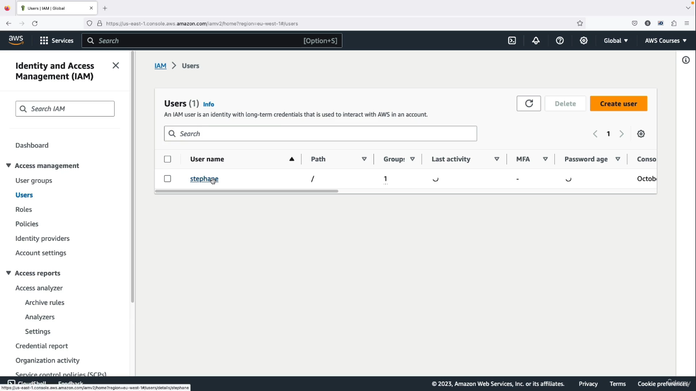
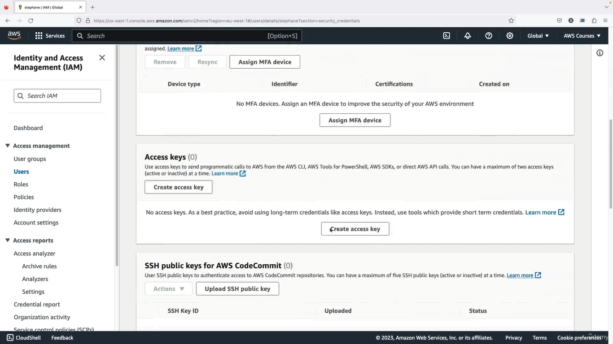
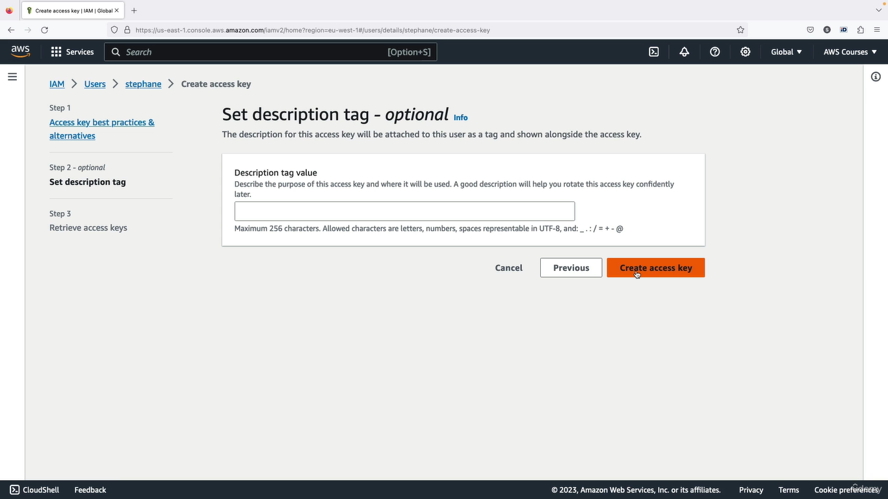
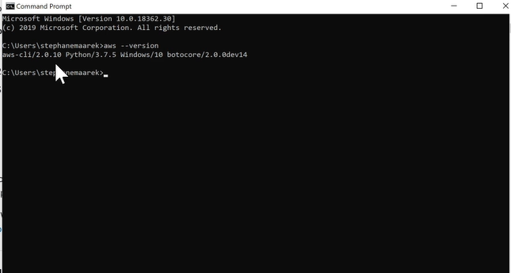

# AWS

## How can we access AWS
### we have three options 
* Console
* Command line interface
* SDK: Software development kit

## Access key
### It is a secreate same as user password.It is generated throut aws console. It contains Access Key ID just like username and Secrete Access Key just like passwrod.

### How to create access key
* Go to IAM -> Users: and click on currect logedin user
    
* Click on security credentials
     
* Scroll down and click on Create Access Key
         
* select use case
         
* click on create secrete key
         
* Download csf file which contains secrete keys
         


## AWS CLI
### A tool that enable you to intract with AWS services using commands in you command line cell

####  Install CLI on windows
* Click on this link and it will download automatically and then install by clicking install and next next
https://awscli.amazonaws.com/AWSCLIV2.msi

* Go to serach bar and serach command prompt.
* Run below command to chekc isntalled or not
    ```
    aws --version
    ``` 
    
* if you find above result in cli it means every thing is fine till here.

#### Configure local command prompt to connect with aws 
* Open command prompt
* Type below command 
    ```
    aws configure
    ```
* Above command will ask for Access key ID , Secrete access key and region. chose region which is closer to you 
    


## AWS SDK
### It AWS software development kit. It is set of libraries or language specific APIs for different programing languages. It allow you to access and mange aws services programatically

## IAM ROLE FOR SERVICES
#### An IAM role is an IAM identity that you can create in your account that has specific permissions. An IAM role is similar to an IAM user. It contains permission policies that determine what the identity can and cannot do in AWS. 

Since we are saying it is identity it must have user_id and password jsut like a user when we create a aws user.Yes it has user_id and password but it is temporary.

### Create Role
* Go to IAM -> User
    
* Create role
    
* Select service on which this role you are going to apply
    
* Attach plicies to that role 
    
* Give Role Name and click on create role
    

* After creating role you can see role information it has ARN also this is identity of role.
    
*You can see permision assigned to role
    


## AWS BUCKET
#### Bucket must have globaly unique name across all regions all account.Bucket must defined in a specific level. S3 look like a global service but bucket are created in a region. It is used to store unstructure data in objec form.Object file have a key, the key is full path of object

Bucket can store max file upto 500gb. If you want to store larger then 500gb you shoudl use multipart upload.

### policies vs permision vs role

