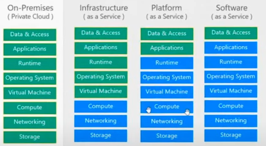

## What is server
 Server contains CPU,RAM,Storage and Network(route,switch,DNS server)

## what is cloud computing

* cloud computing is on-demand delivery of compute, data storage, application, and other IT resources.
*  you only pay for the resources you actually use means you’re charged based on consumption.
* you can provision exactly the right type and size of computing resources you need.

## characterstics of cloud computing
* On-Demand Self-Service: means Users can provision and manage cloud resources instantly without human intervention (e.g., no need to call AWS support to start a server).
* Cloud resources are accessible over the internet from anywhere,
* Resources can scale out (or in) automatically to handle workload changes

## Advantage of cloud 
* you don't own hardware,you're going to pay on-demand and that will reduce your total cost of ownership.
* You no longer need to predict how much server capacity (CPU, RAM, storage, etc.) your application will need in advance.

## Problems solved by cloud
* Flexibility: change resource type when need
* Cons-effectiveness: pay as you go ,for what you use
* Scalibility: The ability of a system to grow to handle increased workload by adding more resources like Vertical scaling and horizontal scalling
* Elasticity: The ability of a system to automatically scale up or down resources based on real-time demand,the system expands during high traffic and contracts during low traffic

* Hig-availbility and fault-tolrance
    * Fault tolerance refers to a system's ability to continue operating without interruption even when one or more components fail. Instead of crashing, the system detects failures and automatically recovers or switches to backup resources

## region and zones
* Region is a geographic area where AWS has multiple data centers,Each region has multiple zones usually 3 min and max 6
### How to chose region
it depends on different factors
* Choose a Region closest to your users for the best performance.It reduce latancy
* Not all AWS services are available in every Region.Check the AWS Regional Services List to ensure the services you need are offered there
* Compliance & Data Residency: If you are not allowed to take data from one country to another,its illigal use specific region
* price vary region to region so chose accordingly,Some Regions are cheaper 

## IaaS vs PaaS vs SaaS

* On-Permises(Private cloud): When we have application on-promises then we as a developer are responsible for managing all the stupff like applicaiton code,database,operating system, storage of machine,Network,compute(processor)

* Infrastructure as a service: Compute,Network and storage is managed by cloud provider. Developer only need to manage application code,Database and operating system.Example of IaaS is EC2. Storage,compute and network failure will be hanle by aws. Operating system will not be managed by aws any falure with os will not be handle by aws,developer are responsible for updating os,change os if need.

* Platform as a service : In platform as a service developer only need to manage application code and database rest of thing will be managed by cloud provider.Like compute,storage,Network,Operating system.Example of platform as a service in aws is App Runner we just need to provide docker image to App Runner.

* In platform as a service cloud provider provides a software like google meet ,gmail in google cloud.these are service provided by google.